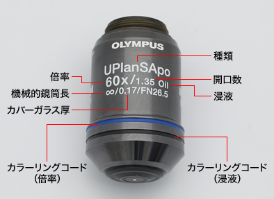

# Microscopes

## Types

## Structure Parts

### Viewing tube

- Monocular tube(in Japanese:単眼): for education
- Binocular tube(in Japanese:双眼): for observating
- Trinocular tube(in Japanese:三眼): for observating + taking images

ref: JMMA, Knowledge of a Microscope 2.顕微鏡の光学系 2.5.鏡筒光学系, http://web.archive.org/web/20220401124033/https://microscope.jp/knowledge/02-5.html

### Objective Lens (in Japanese: 対物レンズ)

How to read the specs:

> 
>
> source of img: OLYMPUS, "顕微鏡の構成と仕様 ～対物レンズ～", 図21, https://www.olympus-lifescience.com/ja/support/learn/02/038/

### eye lens

DIN Standard: dilimeter 23.2mm

## Capabilities

- Resolving Power(Numerical Aperture; NA)
- Magnification; M
- Contrasts

### trade-off relation

#### Depth of Field; DOF

The depth of field (DOF) is inversely proportional to the numerical aperture of the objective lens (NA) and the total magnification (M).

#### Image Brightness

Image brightness is proportional to the square of the numerical aperture (NA) and inversely proportional to the square of the total magnification (M). Gerally, because `M > NA`, the higher the magnification, the darker the image brightness.

where `K` is constants.

> ref: https://www.olympus-lifescience.com/ja/support/learn/02/035

## Specs

### Grade model

1. Professional Model 300,000 - Yen
2. College Model 100,000 - 300,000 Yen
3. School Model 30,000 - 100,000 Yen
4. Family Model 1,000 - 30,000 Yen, stage size is smaller.

ref: Bosque Rico, "激安！おすすめ！価格崩壊中の本格的生物顕微鏡がなぜ凄いのか Eng. ARTEC biological microscope with", https://www.youtube.com/watch?v=ruYlIxc8mco

#### Trends of frame spec

|attr\material|plastic|metal|
|:-:|:-:|:-:|
|for who|kids :child:/students :student: |expert |
|price :moneybag: |low|high|
|durability|low|high|
|accuracy(distortion-less)|low|high|

### Trends of Model Number 

|Symbol|Viewing tube|
|:-:|:-:|
|M|Monocular tube|
|B|Binocular tube|
|T|Trinocular tube|

## Terms

- DIN(Deutsche Industrie-Norm) Standard 

ref:
- WRAYMER, "顕微鏡の用語集", https://www.wraymer.com/howto/glossary.html

## Makers, Brand, Series and Products

The world's four largest makers:

- OLYMPUS, Japan
- NIKON, Japan
- Leica, German
- Zeiss, German

Other Japan maker:

- Meiji Techno, Since 1975, Japan; [[Direct Shop]](http://shop.meijitechno.jp/index.html)
- 八洲光学, Japan; [[neo shop]](http://www.neoshop.rupon.jp/158.html)
- 島津理科
  - Brand: SHIMAZDU
- 内田洋行
  - Brand: UCHIDA
- WRAYMER INC., Japan, Since 2008; [[online shop]](https://www.wraymer.com/shop.html)
- カートン光学, Japan;
- ケニス, Japan; [[online shop]](https://www.kenis.co.jp/onlineshop/list/25)
- ナリカ, Japan;
- 株式会社ヤガミ, Japan;
- ARTEC, Japan
- MIZAR-TEC Co., Ltd., Since 1952
  - Brand: MIZAR; [[catalog]](https://www.mizar.co.jp/product/index/3)

Other maker: 

- Omano Microscopes, China, since 1998;
- United Scope LLC., U.S.; [[official]](https://www.unitedscope.com/brands)
  - Brands: 
    - Euromex Microscopen, Since 1966; [[catalog]](https://www.euromex.com/en/products/products/upright-microscopes/education-upright-microscopes/)
    - AmScope; [[official shop]](https://amscope.com/collections/compound-microscopes) [[amazon store]](https://www.amazon.com/stores/page/352042C3-4DFD-4EF8-A88A-75D1A1697223?ingress=2&visitId=8f0b717d-4588-421e-ad92-cf96ad85931c&ref_=ast_bln)
      - 正規代理店 in Japan: [誠報堂科学館](https://microscope.seihodo.jp/)
    - OMAX; [[online shop]](https://omaxmicroscope.com/compound-microscopes.html?dir=asc&limit=36&order=price)
- Motic, China
  - Brands: 
    - Swift Microscopes; [[Amazon Store]](https://www.amazon.co.jp/stores/page/BEC8886A-1124-41AC-A09C-F4487112C0CA?ingress=2&visitId=a9b34bf8-400b-40a1-96ff-d45dc8a15eb7&ref_=ast_bln)
    - National Optical; [[catalog]](https://nationaloptical.com/products/compound-microscopes) 
- SVBONY, China, Since 2008, [[Official shop]](https://www.svbony.jp/shop/category/microscope?product_list_order_dir=Price,asc&product_list_mode=grid) [[amazon store]](https://www.amazon.co.jp/stores/page/93637938-9117-498C-BCEA-15C15E0344C1?ingress=2&visitId=210c8d99-acf2-4568-a724-0e94412b04b5&ref_=ast_bln)

### online store

online store microscope goods in Japan.

-  [neo shop](http://www.neoshop.rupon.jp/158.html)
-  [スズモリオンライン](https://item.rakuten.co.jp/suzumori/)
-  [学林舎](https://gakurinsha.shop-pro.jp/?mode=cate&cbid=669973&csid=23)

ref:
- Bosque Rico, "独断で選出！国内最強の顕微鏡12メーカーをランキング Eng. BEST 12 Japanese Microscope Makers", https://www.youtube.com/watch?v=GCJFzmxjIW0
- Microscope.com, "MICROSCOPE BRANDS", https://www.microscope.com/education-center/buyers-guides/microscope-brands/
- 誠報堂科学館, "顕微鏡のメーカーについて", publish date: 2015,
http://web.archive.org/web/20190215065421/https://microscope.seihodo.jp/2015/10/%E9%A1%95%E5%BE%AE%E9%8F%A1%E3%81%AE%E3%83%A1%E3%83%BC%E3%82%AB%E3%83%BC%E3%81%AB%E3%81%A4%E3%81%84%E3%81%A6/

## References for Guide

- OLYMPUS, "顕微鏡を学ぶ", https://www.olympus-lifescience.com/ja/support/learn/
